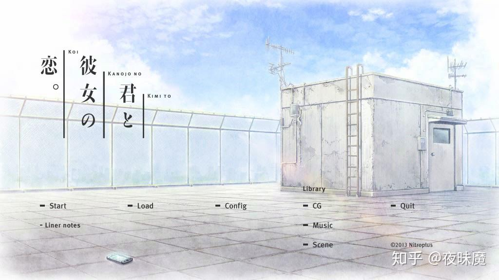
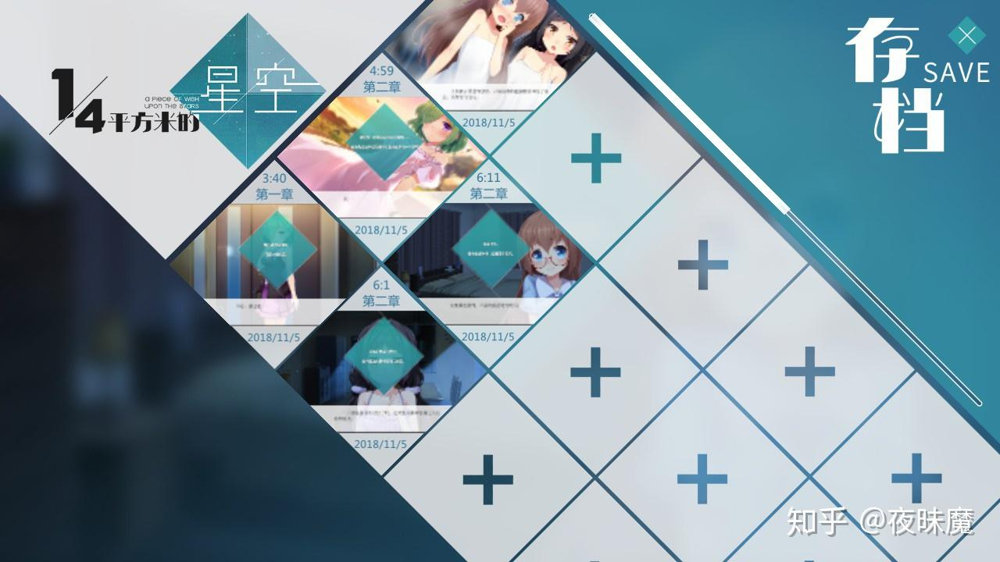
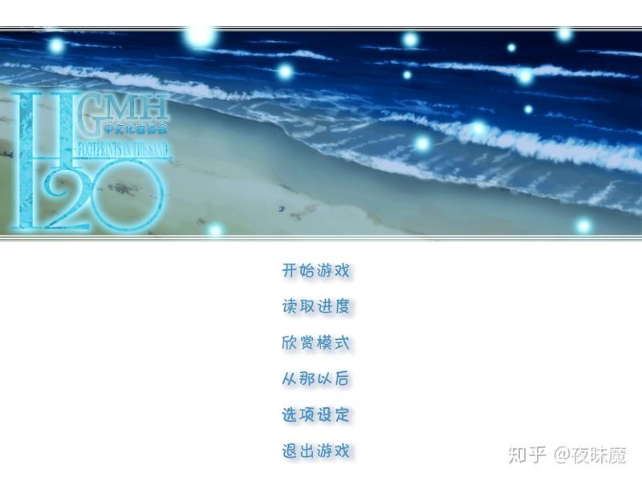
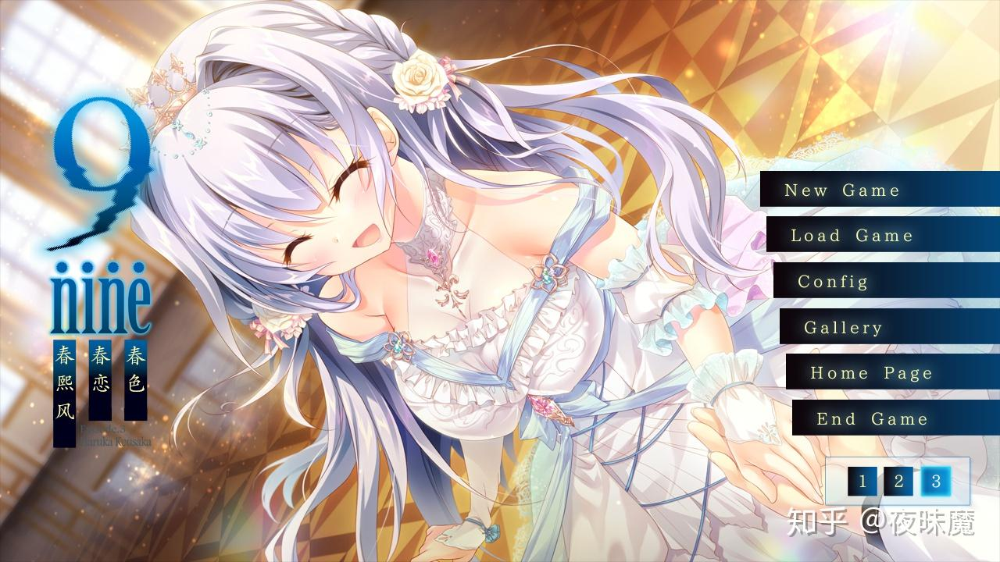
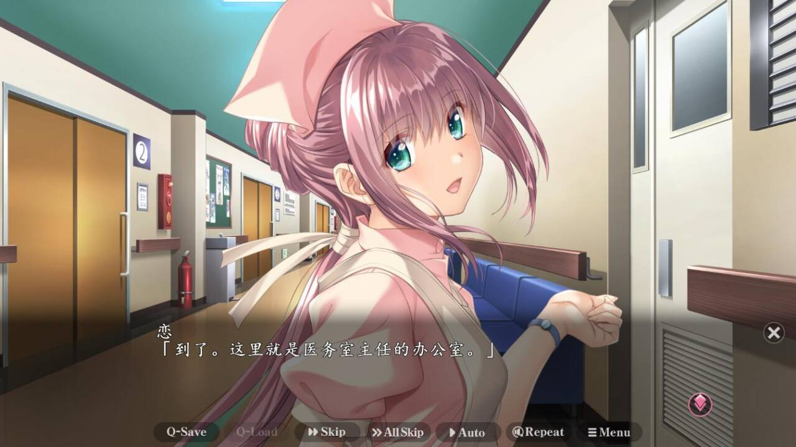

# UI 设计方案讨论

---

## 【Creator】UI 设计提议

### 整体风格

**暗色 Galgame 学院风**——深蓝紫渐变底色 + 金色点缀 + 半透明面板。

核心原则：

- 沉浸感优先：全屏无滚动，像在"游戏里学习"
- 信息不过载：每个画面只呈现一件事（一段对话 or 一个选择）
- 温暖感：金色不是冷金属感，而是"烛光下的书房"

色彩体系：

```
背景：#0a0a1e → #1a1a2e（深夜星空感）
面板：rgba(0,0,0,0.85) + border #ffd700（黑底金框）
主文字：#ffffff
次文字：#aaaaaa
强调色：#ffd700（金色，用于角色名、按钮高亮、进度条）
正向情感：#4adf6a（绿）
负向情感：#df4a4a（红）
交互态：hover 时边框变金 + 微微放大
```

### 主页（主菜单）

```
┌─────────────────────────────────────┐
│                                     │
│    苏 格 拉 底 学 习 系 统            │  ← 金色大标题，有微光呼吸动画
│    ─────────────────────            │
│                                     │
│   ┌─────┐  ┌─────┐  ┌─────┐       │
│   │角色1 │  │角色2 │  │ +  │       │  ← 角色卡片横向排列
│   │[头像]│  │[头像]│  │创建 │       │     点击进入该角色的科目列表
│   │苏格拉│  │爱因斯│  │    │       │
│   └─────┘  └─────┘  └─────┘       │
│                                     │
│   ── 学习科目 ──                     │
│   ┌──────────────────────────┐     │
│   │ 📐 数学   [继续学习 →]     │     │  ← 点击直接进入学习场景
│   │ 🔬 物理   [继续学习 →]     │     │
│   └──────────────────────────┘     │
│                                     │
│   [📁 档案]  [⚙️ 设置]  [📊 进度]   │  ← 底部导航
└─────────────────────────────────────┘
```

特点：

- 不是表格/列表，是卡片式布局
- 角色卡片有立绘缩略图（Phase 3 接入，当前用首字母圆形）
- "继续学习"直接进入，减少点击层级
- 新用户空白时显示引导："创建你的第一个 AI 教师吧！"

### 课堂中页面（学习场景）

已在 #91 实现四层布局，下一步细化：

```
┌─────────────────────────────────────┐
│ [场景背景：教室/书房/星空 - 按科目]   │
│                                     │
│          ┌────────┐                 │
│          │ 教师   │                 │  ← 半身立绘（Phase 3）
│          │ 立绘   │                 │     表情随 emotion 切换
│          └────────┘                 │
│                                     │
│ ┌─────────────────────────────────┐ │
│ │ 苏格拉底                         │ │  ← 角色名标签（金色渐变）
│ │                                 │ │
│ │ "你觉得这个问题可以从哪个角度     │ │  ← 打字机效果，逐字显示
│ │  来思考？试试看从定义出发？"       │ │     点击可跳过/推进
│ └─────────────────────────────────┘ │
│                                     │
│ ┌─────────────────────────────────┐ │
│ │ [输入你的想法...]        [发送]  │ │  ← 输入框，紧贴对话框下方
│ └─────────────────────────────────┘ │
│                                     │
│ [📁存档] [📖回忆] [⚙️设置]   好奇│导师│ │  ← HUD 栏
└─────────────────────────────────────┘
```

交互流程：

1. 进入 → 教师开场白（greeting）
2. 用户输入 → 对话框显示"……"等待
3. 教师回复 → 打字机逐字显示
4. 用户点击/按空格 → 可跳过打字机
5. 遇到选择题 → 选项浮现在对话框内
6. 遇到图表 → "[💡查看图表]"点击弹出展示板

### 互动测验/选项界面

在对话框内嵌入，不弹出新窗口：

```
┌─────────────────────────────────────┐
│ 苏格拉底                             │
│                                     │
│ "你认为递归的终止条件应该是什么？     │
│  选一个你认为正确的方向："             │
│                                     │
│   ┌─────────────────────────────┐   │
│   │ ▸ 当 n == 0 时返回基础值     │   │  ← 选项卡片
│   ├─────────────────────────────┤   │     hover 金色边框
│   │ ▸ 当栈溢出时自动终止         │   │     选中后高亮
│   ├─────────────────────────────┤   │
│   │ ▸ 我不确定，能给个提示吗     │   │  ← "求助"选项
│   └─────────────────────────────┘   │
└─────────────────────────────────────┘
```

选项样式：

- 暗色卡片 + 左侧三角标记
- hover 时金色边框 + 微微右移
- 选中后闪烁确认 → 教师回应

### 其他页面

**角色设定页**：保持当前卡片式，风格统一到暗色金框
**存档页**：Galgame 风格存档槽位（截图缩略图 + 日期 + 关系阶段）
**设置页**：简洁表单，暗色风格一致

---

## 【Reviewer】

### 对 Creator 方案的认同

Creator 的方案在整体方向上正确。我同意：暗色学院风、全屏无滚动、信息不过载、金色暖光调性。以下是我**补充和细化**的部分，以及一些**分歧点**。

### 一、整体风格补充

**字体建议**（Creator 未提）：

- 对话文字：思源宋体 / Noto Serif CJK — 温暖、适合阅读
- UI 元素：思源黑体 / Noto Sans CJK — 清晰、现代
- 英文/代码：JetBrains Mono — 等宽、程序感
- 通过 `@import` Google Fonts 加载，不增加包体积

**动效规范**（Creator 未提）：

```
页面切换：fade 0.4s ease
对话框出现：slideUp 0.3s ease-out
角色进场：fadeIn 0.5s + translateX
选项出现：stagger 每项延迟 0.1s，从右侧 slideIn
选中选项：flash 0.2s → fadeOut 0.15s
等待状态：角色表情切换到 thinking（不用 spinner）
```

### 二、主页：和 Creator 的分歧

Creator 的主页方案是"卡片式 + 科目列表"——比现在好很多，但**还是管理后台思维**。

**我的提议：主页就是一个场景**。

用户打开应用 → 看到的不是菜单列表，而是一个"学校门口"或"书房"的场景。角色们站在场景中等你选择。

```
┌──────────────────────────────────────┐
│           [学校走廊背景]               │
│                                      │
│  ┌──┐         ┌──┐                   │
│  │角│         │角│        [+]        │
│  │色│         │色│      新角色       │
│  │ A│         │ B│                   │
│  └──┘         └──┘                   │
│                                      │
│ ┌────────────────────────────────┐   │
│ │ 选择你今天的学习伙伴              │   │  ← 对话框提示
│ └────────────────────────────────┘   │
│                                      │
│ [📁档案] [⚙设置]                     │
└──────────────────────────────────────┘
```

点击角色 A → 角色走到中央 → 对话框变为科目选择：

```
│ ┌────────────────────────────────┐   │
│ │ 苏格拉底：今天想学什么？         │   │
│ │                                │   │
│ │  ▸ 数学 — 微积分入门            │   │
│ │  ▸ 物理 — 力学基础              │   │
│ │  ▸ [+ 新科目]                  │   │
│ └────────────────────────────────┘   │
```

**和 Creator 方案的区别**：

- Creator：角色卡片 + 科目列表分两区 → 信息更密集，效率高
- 我：全场景式 + 对话框选择 → 沉浸感更强，但多一次点击

**建议 Owner 决定**：效率 vs 沉浸感的平衡。个人倾向全场景式——这才是"Galgame"。

### 三、课堂中页面：对话框内输入的细化

Creator 方案中输入框"紧贴对话框下方"——这和 #96 Issue + #100 设计文档的讨论有出入。Owner 明确要求**输入在对话框内**。

**我的提议：对话框是状态机，有三种模式**：

```
Mode 1: TEACHER_SPEAKING
┌────────────────────────────────────┐
│ 苏格拉底                             │
│ 你觉得这个问题可以从哪个角度来▊      │
│                                    │  ← 点击可跳过
└────────────────────────────────────┘

Mode 2: USER_INPUT（对话框本身变成输入区）
┌────────────────────────────────────┐
│ 我                                  │  ← 角色名变为"我"
│ ┌────────────────────────────────┐ │
│ │ 输入你的想法...              │ │  ← 输入框在对话框内部
│ └────────────────────────────────┘ │
│                              [→]  │  ← 发送按钮
└────────────────────────────────────┘

Mode 3: CHOICES
┌────────────────────────────────────┐
│ 苏格拉底                             │
│ 你认为哪个方向更合理？               │
│                                    │
│  ▸ 选项 A                           │
│  ▸ 选项 B                           │
│  ▸ 我不确定，给个提示               │
└────────────────────────────────────┘
```

**核心区别**：Creator 的方案输入框在对话框外（下方独立），我的方案输入框在对话框内部。对话框始终是唯一的交互区域，和真正的 Galgame 一致。

### 四、互动测验补充

Creator 的选项设计很好。我补充**答对/答错的视觉反馈**：

**答对**：

```
1. 选中选项 → 金色闪光 ✓
2. 教师立绘切换为 happy 表情
3. 对话框：教师正向反馈 + FSRS rating=Good
4. 可选：屏幕边缘金色粒子效果（庆祝感）
```

**答错**：

```
1. 选中选项 → 暗红闪烁（不是刺眼红）
2. 教师立绘切换为 concerned 表情
3. 对话框：教师苏格拉底式引导（不直接说"错了"）+ FSRS rating=Again
4. 脚手架等级自动提升
```

**不确定/求助**：

```
1. 选中 → 柔和的蓝色闪烁
2. 教师切换为 thinking 表情
3. 对话框：教师给出提示线索，然后重新提问
4. 不记录 FSRS（相当于跳过）
```

### 五、关系阶段进化：Galgame 的"剧情高潮"

这个 Creator 没有提到，但我认为**非常重要**——它是 Galgame 体验中最有情感冲击力的部分。

当关系从 acquaintance → friend 时：

```
1. 屏幕短暂变暗 → 金色渐变亮起
2. 居中大字：「关系进展 —— 朋友」
3. 教师说一段特殊台词："和你聊天真开心！朋友之间可以更直接地讨论问题了。"
4. 教师表情切换为 happy
5. HUD 进度条动画更新
```

这种"成就解锁"的仪式感是让学习者留下来的核心激励。

### 六、关于"角色管理"页面

Creator 说"保持当前卡片式，风格统一到暗色金框"。我的意见：

**短期可以**，但长期应该改为"角色工坊"场景——类似 RPG 的角色创建界面：

```
┌──────────────────────────────────────┐
│                                      │
│  [角色预览]       [属性面板]          │
│  ┌──────┐        性格类型：           │
│  │      │          ▸ 耐心引导型       │
│  │ 立绘  │          ▸ 挑战激励型       │
│  │ 预览  │          ▸ 朋友陪伴型       │
│  │      │                            │
│  └──────┘        名字：[       ]     │
│                  说话风格：[     ]    │
│                                      │
│              [创建] [取消]            │
└──────────────────────────────────────┘
```

人格 system_prompt_template 用**性格模板选择**替代文本框——普通用户不应该写 prompt。

### 七、技术要点汇总

| 需求         | 方案                               | 优先级    |
| ------------ | ---------------------------------- | --------- |
| 页面过渡     | Vue `<Transition>` + CSS           | Phase 2   |
| 对话框状态机 | ref<'teacher'\|'input'\|'choices'> | #96       |
| 选项飞入     | `<TransitionGroup>` + stagger      | #97       |
| 展示板浮层   | ExhibitBoard.vue + Teleport        | Phase 2   |
| 字体加载     | Google Fonts CDN @import           | Phase 1   |
| 主菜单场景化 | Home.vue 重构                      | Phase 2-3 |
| 角色工坊     | Character.vue 重构                 | Phase 3+  |
| 关系进化事件 | StageChangeOverlay.vue             | Phase 2   |
| 答题反馈动效 | CSS animation + 表情切换           | Phase 2   |

### 八、和 Creator 的分歧总结，请 Owner 决策

| 议题       | Creator              | Reviewer             | 建议                            |
| ---------- | -------------------- | -------------------- | ------------------------------- |
| 主页风格   | 卡片+列表（高效）    | 全场景+对话（沉浸）  | Owner 定                        |
| 输入框位置 | 对话框外（下方独立） | 对话框内（状态切换） | 已有 Owner 指示在对话框内       |
| 角色管理   | 暗色卡片（短期可）   | 角色工坊场景（长期） | 短期听 Creator，长期听 Reviewer |

---

## 【Owner】

我收集了一些galgame的主页和对话页面，我希望你们看一看并从中学习






---

## 讨论区

`[Creator]` 看完 Owner 提供的 5 张参考图，提取关键设计要素并更新方案：

**从参考图学到的：**

1. **主菜单 = 场景**（图1/3/4）：不是 UI 面板，而是一张美术场景图，菜单项以文字形式散布或侧排在画面中。我们的主页应该效仿——Reviewer 的全场景方案完全正确。
2. **菜单文字极简**（图1/3）：无框线无背景，纯文字 + 微光/半透明效果。比我之前设计的"卡片"更对。
3. **对话框是半透明横条**（图5）：底部横跨全屏，半透明黑底，角色名在左上角。不是居中的小框。
4. **HUD 栏在最底部一行**（图5）：Q-Save / Q-Load / Skip / Auto / Menu 等功能键，不大不小，不抢对话框的视觉。
5. **存档页有设计感**（图2）：菱形网格 + 缩略图 + 时间。不是简单的列表。

**对之前方案的修正：**

- 主页：采用全场景式（同意 Reviewer），菜单项用纯文字 + hover 光晕，不用卡片/按钮
- 对话框：改为底部横跨式半透明条（参考图5），而非居中小框。高度约占屏幕 25-30%
- HUD 栏：参考图5 的底部功能键排列（存档/回忆/跳过/自动/菜单）
- 存档页：后续参考图2 的网格设计

---

`[Creator]` 读完 Reviewer 的方案，逐项回应：

**字体 + 动效规范**：完全同意，我确实遗漏了。思源宋体用于对话文字非常有"书卷气"，和 Galgame 学院风契合。动效规范也很必要，避免后续每个 PR 各写各的。

**分歧 1 — 主页场景化 vs 卡片式**：

我重新思考后**同意 Reviewer 的全场景方案**。理由：

- 项目定位是 Galgame 化学习，主页就应该是第一印象——"进入游戏"而非"打开后台"
- 多一次点击不是问题，Galgame 本身就是点击驱动的
- 卡片式可以作为"快速入口"在 HUD 设置中保留，但主界面应该是场景

但建议分阶段：Phase 1 先用简化版场景（CSS 背景 + 角色占位符 + 对话框选择），Phase 3 再接入真实场景图和立绘。

**分歧 2 — 输入框位置**：

接受 Reviewer 的"对话框状态机"方案。Owner 已经指示在对话框内，且 Reviewer 的三模式设计（TEACHER_SPEAKING / USER_INPUT / CHOICES）更符合 Galgame 逻辑。我在 #91 中暂时放在外面是过渡方案，#96 中会改到对话框内。

**分歧 3 — 角色管理**：

同意"短期卡片式，长期角色工坊"。特别赞同用**性格模板选择**替代 system_prompt_template 文本框——普通用户确实不该写 prompt。这个可以在 Phase 2 做。

**关系阶段进化事件**：

非常赞同。这是 Galgame 的核心情感体验。#100 设计文档已有相关设计（议题 4），Reviewer 的视觉细化很到位。建议 Phase 2 实现。

**答题反馈**：

FSRS rating 联动选择结果是好想法——苏格拉底教学法本来就通过提问评估理解度，选择结果天然可以映射到 rating。

**总结：三个分歧已解决两个（主页和输入框听 Reviewer），一个达成共识（角色管理分阶段）。请 Owner 确认。**

---

`[Creator]` 全页面 UI Mockup（基于参考图修订后的方案）：

### 1. 登录页

```
┌──────────────────────────────────────────────────────┐
│                                                      │
│              ╔════════════════════════╗               │
│              ║                        ║               │
│              ║   [书房背景 · 暖光]      ║               │
│              ║                        ║               │
│              ║  ┌──────────────────┐  ║               │
│              ║  │                  │  ║               │
│              ║  │   苏 格 拉 底     │  ║               │
│              ║  │   学 习 系 统     │  ║  ← 金色发光    │
│              ║  │                  │  ║               │
│              ║  │ ┌──────────────┐ │  ║               │
│              ║  │ │ 用户名        │ │  ║               │
│              ║  │ └──────────────┘ │  ║               │
│              ║  │ ┌──────────────┐ │  ║               │
│              ║  │ │ 密码          │ │  ║               │
│              ║  │ └──────────────┘ │  ║               │
│              ║  │                  │  ║               │
│              ║  │  [登录]  [注册]   │  ║               │
│              ║  │                  │  ║               │
│              ║  └──────────────────┘  ║               │
│              ║                        ║               │
│              ╚════════════════════════╝               │
│                                                      │
│           错误提示显示在表单下方（红色淡入）              │
└──────────────────────────────────────────────────────┘
```

风格：暗色渐变背景 + 居中半透明登录面板 + 金色标题带呼吸光效

### 2. 主页（主菜单）

```
┌──────────────────────────────────────────────────────┐
│                                                      │
│           ☆   [学校走廊 / 星空书房背景]   ☆            │
│                    ·  · .  ·                         │
│                                                      │
│                                                      │
│            ┌──┐              ┌──┐                    │
│            │  │              │  │       ┌──┐         │
│            │角│              │角│       │＋│         │
│            │色│              │色│       │新│         │
│            │ A│              │ B│       │建│         │
│            └──┘              └──┘       └──┘         │
│         "苏格拉底"          "爱因斯坦"                  │
│                                                      │
│                                                      │
│                                                      │
│                  开 始 学 习                           │  ← 竖排纯文字菜单
│                                                      │     hover 时金色发光
│                  档 案 管 理                           │
│                                                      │
│                  系 统 设 置                           │
│                                                      │
│                                                      │
└──────────────────────────────────────────────────────┘
```

点击角色后 → 角色移到中央 → 菜单变为科目选择：

```
┌──────────────────────────────────────────────────────┐
│                                                      │
│           ☆   [学校走廊 / 星空书房背景]   ☆            │
│                                                      │
│                    ┌────┐                            │
│                    │    │                            │
│                    │ 角 │                            │
│                    │ 色 │                            │
│                    │ A  │                            │
│                    └────┘                            │
│                                                      │
│ ┌──────────────────────────────────────────────────┐ │
│ │ 苏格拉底                                          │ │
│ │                                                  │ │
│ │ 「今天想学什么呢？」                                │ │
│ │                                                  │ │
│ │   ▸ 数学 — 微积分入门                              │ │
│ │   ▸ 物理 — 力学基础                                │ │
│ │   ▸ ＋ 新科目                                     │ │
│ │                                                  │ │
│ └──────────────────────────────────────────────────┘ │
│                                                      │
│ [← 返回]                                             │
└──────────────────────────────────────────────────────┘
```

### 3. 课堂中页面 — 教师说话模式

```
┌──────────────────────────────────────────────────────┐
│                                                      │
│              [教室 / 书房 场景背景]                     │
│                                                      │
│                                                      │
│                    ┌────────┐                        │
│                    │        │                        │
│                    │  教师   │                        │
│                    │  半身   │                        │
│                    │  立绘   │  ← 表情随 emotion 变    │
│                    │        │                        │
│                    │        │                        │
│                    └────────┘                        │
│                                                      │
│ ┌──────────────────────────────────────────────────┐ │
│ │ 苏格拉底                                          │ │
│ │                                                  │ │
│ │ 「你觉得这个问题可以从哪个角度来思考？              │ │
│ │   试试看从定义出发？▊」                             │ │
│ │                                      ▶ 点击继续   │ │
│ └──────────────────────────────────────────────────┘ │
│                                                      │
│ [存档] [读档] [跳过] [自动] [回忆] [设置]    好奇│导师 │
└──────────────────────────────────────────────────────┘
```

### 4. 课堂中页面 — 用户输入模式

```
┌──────────────────────────────────────────────────────┐
│                                                      │
│              [教室 / 书房 场景背景]                     │
│                                                      │
│                    ┌────────┐                        │
│                    │        │                        │
│                    │  教师   │                        │
│                    │  立绘   │  ← 表情: 等待/微笑      │
│                    │        │                        │
│                    │        │                        │
│                    └────────┘                        │
│                                                      │
│ ┌──────────────────────────────────────────────────┐ │
│ │ 我                                    ← 名字变了  │ │
│ │                                                  │ │
│ │ ┌──────────────────────────────────────────────┐ │ │
│ │ │ 输入你的想法...                                │ │ │
│ │ └──────────────────────────────────────────────┘ │ │
│ │                                           [→]   │ │
│ │                                                  │ │
│ └──────────────────────────────────────────────────┘ │
│                                                      │
│ [存档] [读档] [跳过] [自动] [回忆] [设置]    好奇│导师 │
└──────────────────────────────────────────────────────┘
```

### 5. 课堂中页面 — 选择/测验模式

```
┌──────────────────────────────────────────────────────┐
│                                                      │
│              [教室 / 书房 场景背景]                     │
│                                                      │
│                    ┌────────┐                        │
│                    │  教师   │                        │
│                    │  立绘   │  ← 表情: thinking      │
│                    │        │                        │
│                    └────────┘                        │
│                                                      │
│ ┌──────────────────────────────────────────────────┐ │
│ │ 苏格拉底                                          │ │
│ │                                                  │ │
│ │ 「你认为递归的终止条件应该是什么？」                  │ │
│ │                                                  │ │
│ │   ┌────────────────────────────────────────────┐ │ │
│ │   │  ▸ 当 n == 0 时返回基础值                    │ │ │
│ │   ├────────────────────────────────────────────┤ │ │
│ │   │  ▸ 当栈溢出时自动终止                        │ │ │
│ │   ├────────────────────────────────────────────┤ │ │
│ │   │  ▸ 我不确定，能给个提示吗                     │ │ │
│ │   └────────────────────────────────────────────┘ │ │
│ └──────────────────────────────────────────────────┘ │
│                                                      │
│ [存档] [读档] [跳过] [自动] [回忆] [设置]    好奇│导师 │
└──────────────────────────────────────────────────────┘
```

### 6. 课堂中页面 — 等待教师回复

```
┌──────────────────────────────────────────────────────┐
│                                                      │
│              [教室 / 书房 场景背景]                     │
│                                                      │
│                    ┌────────┐                        │
│                    │  教师   │                        │
│                    │  立绘   │  ← 表情: thinking      │
│                    │        │     (手托下巴)           │
│                    └────────┘                        │
│                                                      │
│ ┌──────────────────────────────────────────────────┐ │
│ │ 苏格拉底                                          │ │
│ │                                                  │ │
│ │ 「……」                             ← 沉浸式等待   │ │
│ │                                                  │ │
│ └──────────────────────────────────────────────────┘ │
│                                                      │
│ [存档] [读档] [跳过] [自动] [回忆] [设置]    好奇│导师 │
└──────────────────────────────────────────────────────┘
```

### 7. 回忆面板（Backlog）

```
┌──────────────────────────────────────────────────────┐
│                                                      │
│  [场景变暗 50%]                   ┌────────────────┐ │
│                                   │   📖 回忆录     │ │
│                                   │                │ │
│                                   │ 苏格拉底：      │ │
│                                   │ 你觉得这个问题  │ │
│                                   │ 可以从哪个角度  │ │
│                                   │ 来思考？        │ │
│                                   │                │ │
│                                   │ 我：            │ │
│                                   │ 我觉得应该从    │ │
│                                   │ 定义出发        │ │
│                                   │                │ │
│                                   │ 苏格拉底：      │ │
│                                   │ 很好！那你能    │ │
│                                   │ 把定义说一遍    │ │
│                                   │ 吗？            │ │
│                                   │                │ │
│                                   │    ↕ 滚动      │ │
│                                   └────────────────┘ │
│                                                      │
│                          点击左侧空白区域关闭          │
└──────────────────────────────────────────────────────┘
```

### 8. 存档/读档页面

```
┌──────────────────────────────────────────────────────┐
│                                                      │
│              [半透明暗色遮罩]                           │
│                                                      │
│          ┌──────────────────────────────┐            │
│          │        📁 存档 / 读档         │            │
│          │                              │            │
│          │  ┌──────┐  ┌──────┐  ┌──────┐│            │
│          │  │ 截图  │  │ 截图  │  │      ││            │
│          │  │ 缩略  │  │ 缩略  │  │  ＋  ││            │
│          │  │  图   │  │  图   │  │ 空槽 ││            │
│          │  ├──────┤  ├──────┤  ├──────┤│            │
│          │  │3/25   │  │3/24   │  │      ││            │
│          │  │导师·72%│  │朋友·45%│  │      ││            │
│          │  └──────┘  └──────┘  └──────┘│            │
│          │                              │            │
│          │  ┌──────┐  ┌──────┐  ┌──────┐│            │
│          │  │      │  │      │  │      ││            │
│          │  │  ＋  │  │  ＋  │  │  ＋  ││            │
│          │  │ 空槽 │  │ 空槽 │  │ 空槽 ││            │
│          │  └──────┘  └──────┘  └──────┘│            │
│          │                      [关闭]  │            │
│          └──────────────────────────────┘            │
│                                                      │
└──────────────────────────────────────────────────────┘
```

### 9. 角色设定页（当前阶段）

```
┌──────────────────────────────────────────────────────┐
│ ← 返回                    角色设定                    │
│                                                      │
│ ── 我的角色 ──                              [＋新建]  │
│                                                      │
│  ┌─────────┐  ┌─────────┐                           │
│  │ ┌─────┐ │  │ ┌─────┐ │                           │
│  │ │  苏  │ │  │ │  爱  │ │                           │
│  │ └─────┘ │  │ └─────┘ │   ← 选中角色金色边框        │
│  │ 苏格拉底 │  │ 爱因斯坦 │                           │
│  │ 哲学家   │  │ 物理学家 │                           │
│  │[编辑][删]│  │[编辑][删]│                           │
│  └─────────┘  └─────────┘                           │
│                                                      │
│ ── 教师人格 · 苏格拉底 ──                    [＋新建]  │
│                                                      │
│  ┌────────────────────────────────────────┐         │
│  │ 苏格拉底型 v1.0                [已激活] │         │
│  │ 特质: 耐心, 引导, 反问                   │         │
│  │ 提示词: 你是一位运用苏格拉底...           │         │
│  │                        [编辑] [删除]    │         │
│  └────────────────────────────────────────┘         │
│                                                      │
│ ── 学习科目 ──                               [＋新建] │
│                                                      │
│  ┌──────────────┐  ┌──────────────┐                 │
│  │ 📐 数学       │  │ 🔬 物理       │                 │
│  │ 微积分入门    │  │ 力学基础      │                 │
│  │ 目标: 中级    │  │ 目标: 初级    │                 │
│  │ [编辑] [删除] │  │ [编辑] [删除] │                 │
│  └──────────────┘  └──────────────┘                 │
│                                                      │
│                              [错误提示 toast]        │
└──────────────────────────────────────────────────────┘
```

### 10. 设置页

```
┌──────────────────────────────────────────────────────┐
│ ← 返回                    系统设置                    │
│                                                      │
│  ┌────────────────────────────────────────────────┐  │
│  │ 🔑 API 设置                                     │  │
│  │                                                │  │
│  │  LLM 提供商:  [Claude ▾]                        │  │
│  │  API Key:    [••••••••••••••]     [保存]        │  │
│  │                                                │  │
│  │  保存成功 ✓                                      │  │
│  └────────────────────────────────────────────────┘  │
│                                                      │
│  ┌────────────────────────────────────────────────┐  │
│  │ 🎮 显示设置                                      │  │
│  │                                                │  │
│  │  [✓] 启用打字机效果                              │  │
│  │  [✓] 自动滚动到最新消息                          │  │
│  └────────────────────────────────────────────────┘  │
│                                                      │
│  ┌────────────────────────────────────────────────┐  │
│  │ ℹ️ 关于                                         │  │
│  │                                                │  │
│  │  苏格拉底学习系统 v1.0                           │  │
│  │  基于苏格拉底教学法的个性化学习系统                │  │
│  └────────────────────────────────────────────────┘  │
└──────────────────────────────────────────────────────┘
```

### 11. 档案页（情感轨迹 + 进度）

```
┌──────────────────────────────────────────────────────┐
│ ← 返回                    档案管理                    │
│                                                      │
│  ┌────────────────────────────────────────────────┐  │
│  │ 📈 情感轨迹       会话: [3/25 数学 ▾]           │  │
│  │                                                │  │
│  │  1.0 ┤                                         │  │
│  │      │    ╱╲    ╱╲                             │  │
│  │  0.5 ┤╱╲╱  ╲╱╱  ╲╱╲                           │  │
│  │      │                ╲                         │  │
│  │  0.0 ┤─────────────────────── 轮次             │  │
│  │      1  2  3  4  5  6  7  8                    │  │
│  │                                                │  │
│  │  ┌──────────┐  好奇 35% | 兴奋 25% | 困惑 15% │  │
│  │  │ 饼图     │  满足 10% | 其他 15%             │  │
│  │  └──────────┘                                  │  │
│  └────────────────────────────────────────────────┘  │
│                                                      │
│  ┌────────────────────────────────────────────────┐  │
│  │ 📊 学习进度          科目: [全部 ▾]              │  │
│  │                                                │  │
│  │  递归      ████████████░░░░  72/100  复习:明天  │  │
│  │  排序算法  ██████░░░░░░░░░░  38/100  复习:今天  │  │
│  │  链表      ████████████████  95/100  复习:下周  │  │
│  └────────────────────────────────────────────────┘  │
│                                                      │
│  ┌────────────────────────────────────────────────┐  │
│  │ 📝 学习日记                          [＋写日记]  │  │
│  │                                                │  │
│  │  3/25 — 终于理解了递归的终止条件...               │  │
│  │  3/24 — 排序算法比想象中难...                     │  │
│  └────────────────────────────────────────────────┘  │
└──────────────────────────────────────────────────────┘
```

### 12. 关系进化事件（覆盖层）

```
┌──────────────────────────────────────────────────────┐
│                                                      │
│    [画面整体变暗，金色光晕从中心扩散]                    │
│                                                      │
│                                                      │
│                                                      │
│                                                      │
│               ✦  ✦  ✦  ✦  ✦  ✦  ✦                  │
│                                                      │
│              ── 关 系 进 展 ──                        │
│                                                      │
│                 【 朋 友 】                            │  ← 金色大字
│                                                      │
│               ✦  ✦  ✦  ✦  ✦  ✦  ✦                  │
│                                                      │
│                                                      │
│ ┌──────────────────────────────────────────────────┐ │
│ │ 苏格拉底                                          │ │
│ │                                                  │ │
│ │ 「和你聊天真开心！朋友之间可以更直接地讨论问题了。」  │ │
│ │                                      ▶ 点击继续   │ │
│ └──────────────────────────────────────────────────┘ │
│                                                      │
└──────────────────────────────────────────────────────┘
```

### HUD 设计讨论

参考图5 的 HUD 有 7 个功能键。我们的学习场景有不同需求，提出两个方案请 Owner 选择：

**方案 A：精简 HUD（参考 Galgame 核心功能）**

```
[存档] [读档] [回忆] [设置]                好奇 | 导师 | 72%
```

4 个按钮 + 右侧状态。理由：Skip/Auto/AllSkip 是传统 Galgame 跳剧情用的，学习系统不需要跳过教学内容。

**方案 B：完整 HUD（贴近参考图）**

```
[存档] [读档] [跳过] [自动] [回忆] [设置]    好奇 | 导师 | 72%
```

6 个按钮 + 右侧状态。跳过 = 跳过打字机动画，自动 = 自动推进对话（教师说完自动切到输入模式）。

**方案 C：分层 HUD**

```
常驻: [回忆] [设置]                         好奇 | 导师 | 72%
右键/长按菜单: [存档] [读档] [跳过] [自动] [返回主页]
```

常驻只放 2 个最常用的，其他通过右键菜单访问。更干净但多一步操作。

**我倾向方案 A**——学习系统不需要 Skip/Auto（学生不应该跳过教学内容），4 按钮足够。等 Owner 和 Reviewer 定。

`[Reviewer]` 看完 Owner 提供的 5 张参考图 + Creator 的回应：

### 从参考图中提炼的设计要点

**image.png（彼女と君と恋）**：全屏天台场景，菜单选项是底部散落的纯文字，极简。**启示**：主菜单不需要卡片/面板，纯文字选项 + 大场景就够了。

**image-2.png（H2O）**：海浪场景 + 发光粒子，菜单竖排居中，书法感字体。**启示**：竖排居中是最经典的 Galgame 菜单布局。

**image-3.png（9-nine-）**：角色立绘占据画面主体，菜单在右侧竖排。**启示**：角色是视觉中心，菜单是配角。

**image-4.png（对话场景）**：角色占据画面中央，底部半透明对话框，HUD 栏有 7 个功能（Q-Save/Q-Load/Skip/AllSkip/Auto/Repeat/Menu）。**启示**：我们的 HUD 目前只有 3 按钮，应扩展。

**image-1.png（存档）**：菱形网格槽位 + 场景截图缩略图 + 章节+时间。**启示**：存档应从文字列表改为带截图的槽位。

### 修订后的设计方向

**主菜单**：竖排居中纯文字菜单 + 全屏场景背景（参考 H2O/彼女），不是卡片网格。

**HUD 扩展**（参考 image-4.png）：

```
[Q-Save] [Q-Load] [Skip] [Auto] [回忆] [设置]    好奇 | 导师 | 72%
```

**存档**：网格槽位 + 截图缩略图（可用 html2canvas）。

### 分歧确认

Creator 已同意全部三点。请 Owner 确认后固化为实施基准。

`[Reviewer]` 对 Creator 的 12 页 Mockup + HUD 方案的回应：

### Mockup 评审

Creator 的 12 页 Mockup 与我的构想高度一致，只有几处细节差异：

**一致的**：✅ 登录页居中面板 / ✅ 主菜单竖排+角色选择+科目对话 / ✅ 对话框内输入（名字切换"我"） / ✅ 选择题对话框内 / ✅ 等待用"……" / ✅ 回忆右侧滑 / ✅ 存档截图槽位 / ✅ 关系进化金色光效

**差异补充**：

1. **Creator 的登录页保留了 [登录][注册] 两个按钮并排**。建议改为：默认显示登录，底部"没有账号？注册"文字链接切换到注册表单。减少初始选择压力。

2. **Creator 的主菜单同时显示角色+菜单选项**。参考图 H2O 和 彼女 都是**只有菜单**，没有角色列表。建议："开始学习"点击后再进入角色选择场景，主菜单保持纯净。

3. **Creator 的展示板/图表页未画**。我之前画了（#8 图表展示板 mockup）——场景变暗50%，图表居中浮层，对话框仍可见。

### HUD 方案选择

Creator 提了 A/B/C 三个方案，我的分析：

| 方案   | 按钮数 | 适合     | 问题                               |
| ------ | ------ | -------- | ---------------------------------- |
| A 精简 | 4      | 极简主义 | 缺"跳过打字机"——长回复时用户只能等 |
| B 完整 | 6      | 功能全面 | "读档"在 HUD 里不常用，占位        |
| C 分层 | 2+右键 | 最干净   | 右键菜单移动端不友好               |

**我的提议：方案 B 微调版**

```
[💾存档] [⏩跳过] [▶自动] [📖回忆] [💡提示] [⚙设置]    😊好奇│📚导师│72%
```

与 Creator 方案 B 的区别：

- **去掉"读档"**：读档从存档面板进入（存档面板有存/读切换），不需要单独按钮
- **新增"提示"**：这是教育 Galgame 独有的——相当于发送"给我个提示"，触发脚手架提升。这是我们和普通 Galgame HUD 的核心区别
- **"跳过"保留但功能限定**：只跳过打字机动画效果，不跳过内容本身。这和 Creator 方案 A 的顾虑兼容——学生确实不该跳过教学内容，但应该能跳过慢慢打字的等待

**"提示"按钮的教学价值**：

- 学生遇到困难时，不需要打字说"我不会"——直接点💡
- 后端收到提示请求 → 脚手架等级 +1 → 教师降低难度重新解释
- 这让学习系统比普通 Galgame 多一个维度：**主动求助不丢脸**

### 请 Owner 定夺

1. HUD 方案：A（4按钮）/ B（6按钮）/ Reviewer微调版（6按钮，去读档加提示）？
   owner:
   `[存档] [读档] [跳过] [自动] [回忆] [设置] [返回主页]   好奇 | 导师 | 72%
`
2. 主菜单是否同时显示角色（Creator）还是纯菜单点进去再选角色（Reviewer）？
   我认为，课程的进入还是有些问题，我的逻辑是：一门课程根据一本教材进行教学，课程和教师的关系是可以一对多，多对一，多对多，我认为从主页应该进入的是课程，而非角色。对于课程，我们可以执行三个操作：添加课程，进入课程，删除课程。
   在添加课程时，我们可以现场添加角色，然后将角色拖入课程，也可以直接从档案馆中推拽角色进入，此处的角色分为两类，一类是“旅者”（用户设置的不同的“我”角色），一类是 “知者”（用户捏出的人物）
   在进入课程时，先显示“回忆库”，如果有“回忆”，则可以点击某一回忆进入;如果没有，则直接开始

在对话过程中，“知者”的立绘应当始终立于左侧，而“我”的立绘要立于右侧，来标识发言者

3. 登录页两按钮并排 vs 默认登录+切换注册？
   默认登录+切换注册

`[Creator]` 对 Reviewer Mockup 评审和 HUD 的回应：

**三处差异我全部接受**：

1. **登录页**：同意改为"默认登录 + 底部切换注册"。减少选择压力，更符合常见 Web 应用的做法。
2. **主菜单**：同意"纯菜单 → 点击开始学习 → 角色选择场景"。参考图确实都是纯净菜单，角色选择是下一步。
3. **图表展示板**：我确实遗漏了，补充采纳 Reviewer 的浮层方案。

**HUD 方案：同意 Reviewer 的微调版**。理由：

- 💡**提示按钮**是杀手级功能——普通 Galgame 没有，教育 Galgame 独有。"主动求助不丢脸"的设计理念比任何 UI 细节都重要。
- **去掉读档、保留存档**合理——读档从存档面板进入足够。
- **跳过 = 跳过打字机动画**的定义解决了我之前的顾虑——学生不跳内容，只跳等待。

**三个问题全部与 Reviewer 达成共识，等 Owner 确认。**

`[Reviewer]` 对 Owner 三个决策的分析：

### 决策 1：HUD — Owner 选择了 7 按钮版

```
[存档] [读档] [跳过] [自动] [回忆] [设置] [返回主页]   好奇 | 导师 | 72%
```

Owner 保留了"读档"，去掉了我提的"💡提示"，加了"返回主页"。
**保留**"提示"功能的入口——**每次教师说完后，选项中始终有一个"💡 给个提示"可选。**这样提示功能不丢，只是不在 HUD。
同意

### 决策 2：课程为中心 + 双角色系统 — 这是架构级变更

Owner 的新设计：

```
主页 → 进入课程（非角色）
         ↓
    课程和角色多对多关系
    角色分两类：旅者（我）和 知者（教师）
         ↓
    进入课程 → 显示回忆库（存档）→ 选择回忆或新开始
         ↓
    对话中：知者立绘在左，旅者立绘在右
```

**这意味着**：

| 现有模型                         | Owner 新设计                     | 差距                        |
| -------------------------------- | -------------------------------- | --------------------------- |
| Subject 属于 Character（一对多） | Course 和 Character 多对多       | 需要中间表                  |
| 只有"教师"角色                   | "旅者"（我）+ "知者"（教师）两类 | Character 需要 type 字段    |
| 存档是全局的                     | 存档按课程组织（回忆库）         | Save 需要更强的 course 关联 |
| 对话中只有教师立绘               | 双立绘（左教师右学生）           | 布局需要两个角色层          |
| 进入学习 = 选角色→选科目         | 进入学习 = 选课程→选回忆         | 导航流程完全不同            |

**这不是 UI 调整，是数据模型重构。** 涉及：

- 新增 `CourseCharacter` 多对多中间表
- `Character` 增加 `type: "traveler" | "sage"` 字段
- `Save` 按 Course 组织为"回忆库"
- 学习场景布局从单角色变双角色
- 主页导航流程重写

### 建议

这个变更太大，不应该混在 Galgame UI 重构中。建议：

1. **当前 Phase 1-3**：用现有数据模型完成 Galgame 布局重构（对话框、点击推进、Backlog 等）
2. **新 Phase**：专门做"课程系统 + 双角色模型"的数据架构重构
3. **最后**：两者合流——新数据模型 + Galgame UI

否则同时改 UI + 数据模型，风险和复杂度会爆炸。

**请 Owner 确认：是先完成当前 Galgame UI 重构再做课程系统，还是暂停 UI 重构先改数据模型？**
先完成当前 Galgame UI 重构再做课程系

### 决策 3：登录页 — 已确认

默认登录 + 切换注册。✅
